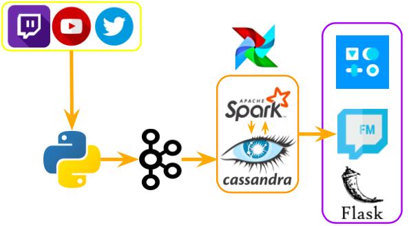
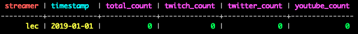
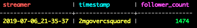

# FollowMe

A real-time platform that describes the most followed streamers on Twitch, YouTube and Twitter.

You can check the website here ([FollowMe](http://towardsdataengineering.com))

## Table of contents
1. [Motivation](#motivation)
2. [Architecture](#architecture)
3. [Implementation Overview](#implementation-overview)
    1. [Data Simulation](#data-simulation)
    2. [Data Ingestion](#data-ingestion)
    3. [Database](#database)
    4. [Data Processing](#data-processing)
    5. [Workflow Management and Scheduling](#workflow-management-and-scheduling)
    6. [Web App](#web-app)
4. [Future Improvements](#future-improvements)
    1. [Pulsar](#substitute-spark-batch-for-spark-streamingkafka-streams-pulsar)
    2. [Terraform](#implement-self-healing-componenet-with-terraform)
5. [Slides](#slides)
6. [Website & Video](#website--video)
6. [If you are an Insight Fellow...](#if-you-are-an-insight-fellow)
7. [Credits](#credits)

## Motivation

The gaming community has it's own brand of influencers: streamers. The gaming equivalent of superstars,
streamers interact with their community much more than the usual influencer. They typically stream multiple hours a day,
and chat with their fans live on stream, providing instant communication and a feeling of knowing. Twitter and YouTube serve 
as secondary platforms to promote their stream highlights, post exclusive content like Q&A or fan meetups,
do sponsored content like play other videogames or talk about their setup, etc.
  
Streamers exert a tremendous influence in their communities, and they often rely on their patronage to earn their
revenue, usually via Twitch subscriptions and donations, YouTube ads and partnerships with brands that want to 
be promoted by the streamer.

The motivation of this project is twofold:
* **As a business that wants to target the gaming community**, I want to find a good suit to associate my brand with. 
    * If I'm a keyboard seller, I would like to know who are the most influential PC streamers, as they are more likely to 
have fans that would invest in a good keyboard. 
    * Promoting a Horror film? Look for streamers that play Horror games, 
since their fans will likely be more receptive to the genre.
* **As a streamer**, I want know if I'm a community leader and how I compare to my peers, as well as a way to monitor
my overall presence in all social media platforms that I operate in. Streamers also collaborate with a multitude of partners
in several ways, and we would like to be able to quantify the effect of such collaborations. For example:
    * Partnering with a company, and having the company mention me in Twitter, YouTube or their own website. 
    * Partnering with another streamer, via cross-overs or hosting/being hosted.
    * Appearing in a highlight compilation, or a viral video.

In all these cases, having a historical evolution of your follower count helps to quantify the effect of these collaborations and
how to plan future content according to what we've seen in the past. You may even recognise bearish patterns: associating 
with a company that is not well regarded within the community may cause people to dislike us or stop watching our content.

FollowMe aims to solve all these issues by providing several dashboards with the necessary information, as well as 
storing the historical data for all these streamers.

***Note***: Each platform has it's own name for followers (YouTube has subscribers, but it's a different kind of 
subscriber than Twitch, who also has followers, like Twitter.). We will use the term 'follower' to refer to each platform's
FREE option to follow/be notified of a streamer's activity.

## Architecture

The project's architecture is as follows:

	
## Implementation Overview

Let's take a high-level overview of each part of the pipeline. For a more in-depth discussion of each block, please refer
to the corresponding folder's README. 

#### Data Simulation

Although Twitch, Twitter and YouTube all have APIs that are publicly accessible, they don't service enough requests per
second to sustain this application unless you have an explicit partnership with them. Hence, we explore the APIs to 
see what data we can extract with a public key. We can obtain:
* Twitch:
    * Follower count
    * Game that is being played
    * Language that the streamer associates with (typically they will speak in this language preferably)
    * Genre and console (via Giantbomb API)
    * Twitter and YouTube accounts associated to the streamer 
* Twitter:
    * Follower count
* YouTube
    * Follower count
    
***Note***: There's much more that can be accessed via the public API, like views, likes, retweets, etc. If a streamer chooses to,
they can provide us with a Personal API Key enables more requests than the public API and access to private information 
and additional metrics. 

Simulations are used twice:
* Historical data and backfilling Cassandra. The schema looks like this:

* Live-data ingested by Kafka and written into Cassandra. The schema looks like this (for each social media platform):

#### Data Ingestion

Data Ingestion is performed by Kafka. There are 3 Kafka topics, one for each platform, and also 3 consumer groups,
one for each topic.

#### Database

The database of choice is Cassandra. Cassandra is a powerful NoSQL database that enables easy scaling,
fault-tolerance, high-availability and very fast write speeds.

On a high level, the database is structured as such:
* Static tables with information about the games and the streamers
* Unified tables that contain all platform data for a specific stremer, timestamp and time window (days, hours,...)
* Aggregation tables with metric aggregation and classifications by game, genre, etc.
* Live tables that contain second by second data, one for each platform. They act as sinks for the Kafka topics.
* Materialized views that allow to filter the tables by date, and also contain a subset of the unified and live tables.

#### Data Processing

We do all data processing with Spark. There's two types of processes:
* Backfill process: After simulating the historical data, Spark gives consistency and coherence to the database.
* Live process: Spark aggregates the live data into minute data and unifies all platforms. Similar scripts process the data
further, from minute by minute to hourly data, and then to daily data. Spark also takes care of calculating the aggregations
based on game, genre, etc.

#### Workflow Management and Scheduling

Spark processes need to be executed periodically and in specific orders to maintain consistency. We also need to create and 
destroy and recreate Materialized Views in Cassandra to conserve memory and reduce latency as much as possible on a daily basis at least.

All these processes are monitored and scheduled with Airflow.

#### Web App

The front end of the project uses Flask to service the website and has Dash charts and tables embedded to allow 
for dynamical graphs and live updates of follower counts.

## Future Improvements

#### Substitute Spark Batch for Spark Streaming/Kafka Streams/ Pulsar

After completing the project, I realised that most of the aggregations that Spark was performing were more suited
for streaming. Having a batch process that can backfill the tables in case of service interruption or a need
to recalculate is nice to have, but it is clear to me now that streaming is a much better approach to this problem.

What is Pulsar? Apache Pulsar is an ingestion platform that aims to solve some of Kafka's caveats, 
but my main interest is in scalability. Because of Pulsar's architecture, replacing a node or adding more nodes
to the cluster can be done without interrupting the service, goes along with the philosophy of the project. 

#### Implement self-healing componenet with Terraform

Once Pulsar and Cassandra are set up, because of the ease of replacing nodes, we can set up Terraform scripts
that can take down a failing node and spin up a new one. 

## Slides

You can check the presentation slides 
[here](https://docs.google.com/presentation/d/1UpNmw95wN_NGe13Dzem3Er8Wz7eA51D9ndEI0FDk3TQ/edit#slide=id.g5c9bf8bdec_0_0)

## Website & Video

You can check the website [here](http://towardsdataengineering.com).

If the website is down, you can also check a video demo [here](https://www.youtube.com/watch?v=kklPSmoyZfU)

## If you are an Insight Fellow...

... looking for a seed, you can use this as your starter. 
Contact me through Mattermost and let's talk!

## Credits

WebApp was created using this template by Todd Birchard 
([Github link](https://github.com/toddbirchard/plotlydash-flask-tutorial)).

Special thanks to the Insight Team and Fellows in NY for their support and for making this project possible.
In no particular order: Masha, Helena, Hoa, Peter, Konrad, James, Matt, Evo, Gerry and David.

