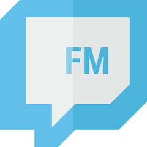

# FollowMe

Data Engineering Insight Project

One line introducing the project, plus image.

Link to presentation

Link to demo web app (?)

## Table of contents
1. [Motivation](#motivation)
2. [Architecture](#architecture)
3. [Implementation Overview](#implementation-overview)
    1. [Data Simulation](#data-simulation)
    2. [Data Ingestion](#data-ingestion)
    3. [Database](#database)
    4. [Data Processing](#data-processing)
    5. [Workflow Management and Scheduling](#workflow-management-and-scheduling)
    6. [Web App](#web-app)
4. [Future Improvements](#future-improvements)
5. [If you are an Insight Fellow...](#if-you-are-an-insight-fellow)
6. [Credits](#credits)

## Motivation

## Architecture
	
## Implementation Overview

#### Data Simulation

#### Data Ingestion

#### Database

#### Data Processing

#### Workflow Management and Scheduling

#### Web App

## Future Improvements

## If you are an Insight Fellow...

... looking for a seed, you can use this as your starter. 
Contact me through Mattermost and let's talk!

## Credits
Who you took code from / inspiration:
* flask + dash guy